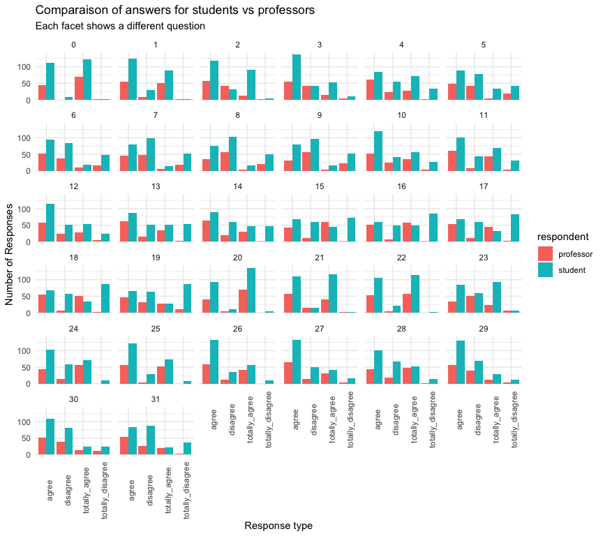

# Likert Survey Analysis

## Loading the libraries

``` r
library(dplyr)
library(janitor)
library(tidyr)
library(ggplot2)
library(readxl)
library(stringr)
```

## Part 1

Loading the data that is in the `data` folder.

``` r
students <- read_excel("data/likert_survey.xlsx", sheet = "students") %>%
  clean_names() 

professors <- read_excel("data/likert_survey.xlsx", sheet = "professors")%>%
  clean_names()
```

## Part 2

We are now looking into the total number of answers obtained by
students, professors and if each question obtained the same number of
answers.

To answer the first two questions I am using the `tidyverse` way,
putting together the dataset, to then create long format data. This will
allow me to exploit the power of grouping and summarising.

``` r
# let's first put the two datasets together

students <- students %>% 
  mutate(respondent = "student") # create a respondent column

professors <- professors %>% 
  mutate(respondent = "professor") # create a respondent column

# We can now bind together the two tibbles

total <- bind_rows(students, professors)

# use head(total) to inspect the element

# And now we can use pivot_longer to get it in a tidy format

total <- total %>% 
  pivot_longer(names_to = "response_type",
               values_to = "value",
               cols= c(-question_id, -respondent))

head(total)
```

    ## # A tibble: 6 × 4
    ##   question_id respondent response_type    value
    ##         <dbl> <chr>      <chr>            <dbl>
    ## 1           0 student    totally_disagree     2
    ## 2           0 student    disagree             9
    ## 3           0 student    agree              111
    ## 4           0 student    totally_agree      122
    ## 5           1 student    totally_disagree     2
    ## 6           1 student    disagree            30

After having wrangled the data to have it in tidy format, I can respond
to the first two questions.

``` r
total %>% 
  group_by(respondent) %>% 
  summarise(total_answer = sum(value)) %>% 
  ungroup() %>% 
  rename('Total Answer' = total_answer,
         Respondent = respondent) %>% 
  knitr::kable()
```

| Respondent | Total Answer |
|:-----------|-------------:|
| professor  |         3654 |
| student    |         7748 |

We are now checking if each question have the same number of answers.

``` r
total %>% 
  group_by(respondent, question_id) %>%  # we group_by respondent and question_id
  summarise(total_answer = sum(value)) %>% # we calculate the total answer per question and respondent
  ungroup() %>% # we ungroup!
  distinct(respondent, total_answer) # we keep only the unique values
```

    ## `summarise()` has grouped output by 'respondent'. You can override using the
    ## `.groups` argument.

    ## # A tibble: 12 × 2
    ##    respondent total_answer
    ##    <chr>             <dbl>
    ##  1 professor           115
    ##  2 professor           113
    ##  3 professor           112
    ##  4 professor           111
    ##  5 professor           103
    ##  6 student             244
    ##  7 student             233
    ##  8 student             234
    ##  9 student             239
    ## 10 student             241
    ## 11 student             238
    ## 12 student             230

The answer is *No* as we can see that not all questions have been
answered the same amount of time, for both professors and students. It
means that some respondents left some questions unanswered.

## Part 3

I am now comparing the distribution of answers of the students versus
the professors.

``` r
total %>%
  ggplot(mapping = aes(x =response_type,
                       y = value,
                       fill = respondent)) +
  geom_col(position = "dodge") + 
  facet_wrap(vars(question_id)) + 
  labs(title = "Comparaison of answers for students vs professors",
       subtitle = "Each facet shows a different question",
       x="Response type", 
       y="Number of Responses",
       fill = "respondent") +
  theme_minimal()+
  theme(axis.text.x = element_text(angle = 90)) # tilting the text
```

<!-- -->

From this chart, we can see that basically for each question, students
gave more answers.

## Part 4

Now I am computing the mode for the students and professors for each of
the questions.

``` r
total %>%
  group_by(question_id, respondent) %>%
  slice_max(order_by = value, n = 1) %>% 
  ungroup()
```

    ## # A tibble: 64 × 4
    ##    question_id respondent response_type value
    ##          <dbl> <chr>      <chr>         <dbl>
    ##  1           0 professor  totally_agree    70
    ##  2           0 student    totally_agree   122
    ##  3           1 professor  agree            55
    ##  4           1 student    agree           124
    ##  5           2 professor  agree            57
    ##  6           2 student    agree           119
    ##  7           3 professor  agree            55
    ##  8           3 student    agree           138
    ##  9           4 professor  agree            62
    ## 10           4 student    agree            85
    ## # ℹ 54 more rows

In order to make the data nice to present in a table we can select
`response_type`, `respondent` and `question_id` and use `pivot_wider()`
so to have one line per `question_id`.

``` r
total %>%
  group_by(question_id, respondent) %>%
  slice_max(order_by = value, n = 1) %>% # we keep the top 1 value for each group
  ungroup() %>% 
  select(-value) %>% 
  pivot_wider(names_from = respondent, values_from = response_type)
```

    ## # A tibble: 32 × 3
    ##    question_id professor     student      
    ##          <dbl> <chr>         <chr>        
    ##  1           0 totally_agree totally_agree
    ##  2           1 agree         agree        
    ##  3           2 agree         agree        
    ##  4           3 agree         agree        
    ##  5           4 agree         agree        
    ##  6           5 agree         agree        
    ##  7           6 agree         agree        
    ##  8           7 disagree      disagree     
    ##  9           8 disagree      disagree     
    ## 10           9 disagree      disagree     
    ## # ℹ 22 more rows
